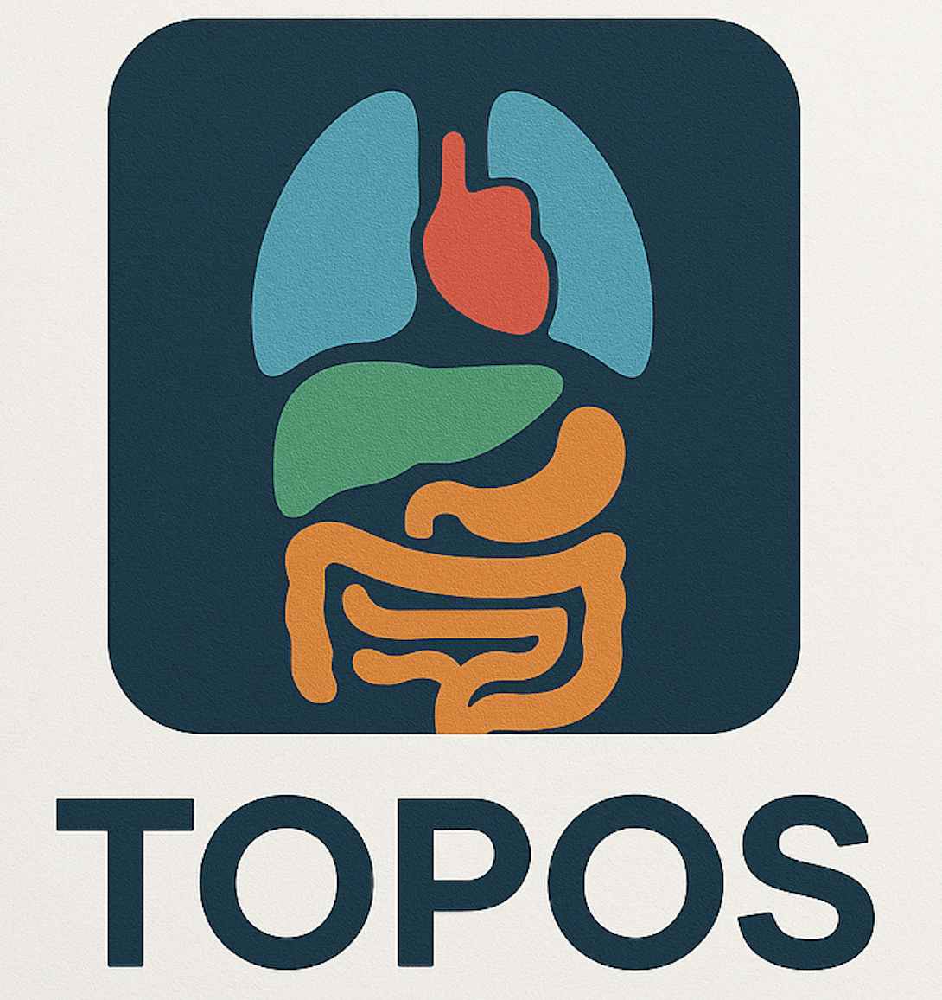

# Target Organ Prediction of Scout Views for Automated CT Scan Planning
CT-overscanning is a substantial and avoidable source of radiation exposure in medical imaging. TOPOS was designed to be used as an easy-to-apply tool for automatic scan planning. Using the nnU-Net framework, it enables the identification and segmentation of 26 target structures for 5 examination regions, which can be used for automatic scan planning and visual guideance for the technologist. The associated scientific manuscript has been published and should be cited as follows when used:

## Installation
Install TOPOS with pip:

```
# Create virtual environment
conda create -n topos python=3.11 pip
conda activate topos

# Install TOPOS
python -m pip install toposv
```

## Inference
Topos segments a single nii.gz file within the input directory and writes segmentations to the specified output directory.
```
topos_predict -i <path/to/input/folder> -o <path/to/output/folder>
```

## Contributing

Contributions are welcome as soon as we share the full code. If you would like to suggest improvements or add new features, please fork the repository and submit a pull request.

## License

This project is licensed under the Apache 2.0 License.

## Contact

For any questions or feedback, please contact s.ziegelmayer@tum.de
